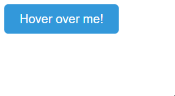
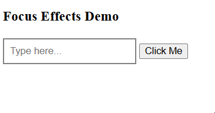
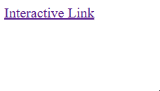
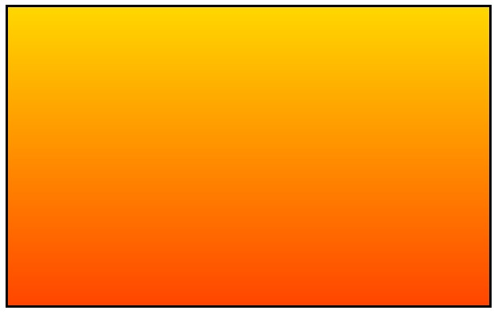
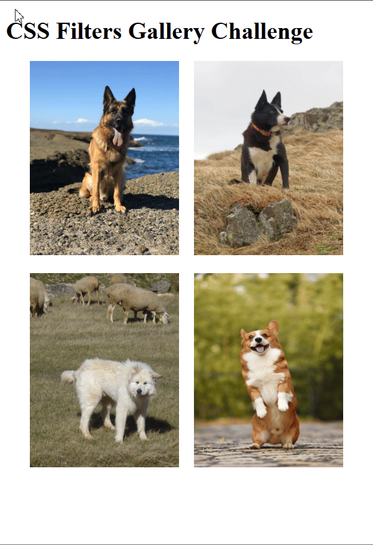
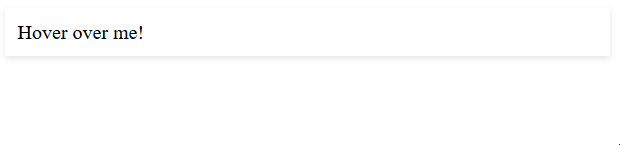

# CSS Mastery

## Selector Mastery - Combination:

### Introduction:

In the previous repository, we looked at basic selector like **tags, classes, IDs, group selectors**, and **the universal selector**. These gave you the tools to start styling elements on the page.

Now we're stepping things up a bit. In this chapter, you'll lern some smarter ways to target elements, like <i>how to style an element only if it's inside another, or right after another.</i>

These techniques make your CSS cleaner, more flexible and easier to manage as your projects grow.

### Descendant Selector:

The first selector is the **descendant selector**. We use it when we want to style elements tht are inside another element, even if they are deeply nested. For example, ther are two paragraphs inside a container:

```html
<div class="container">
    <p>This is a paragraph inside a div.</p>
    <section>
        <p>This is a paragraph inside a section that is inside a div.</p>
    </section>
</div>
```

#### Basic Syntax:

Now, let's use a descendant selector to style all paragraphs inside the div:

```css
.container p {
    color: blue;
}
```

All paragraphs inside the `.container` div will turn blue, even the one nested inside the `selection` element.

#### Example of Usage:

```html
<html>
<head>
    <title>Descendant Selector</title>
    <style>
        .navigation li { color: purple; }
    </style>
</head>
<body>
    <ul class="navigation">
        <li>Home</li>
        <li>Team
            <ul>
                <li>Players</li>
                <li>Coaches</li>
            </ul>
        </li>
        <li>Tickets</li>
    </ul>
</body>
</html>
```

##### Result:


### Child Selector:

The **child selector (`>`)** is used when we want to style elements that are direct children of another element. Unlike the descendant selector, it only selects direct children, not deeper ones.

#### Basic Syntax:

For example, take this HTML document:

```html
<div class="parent">
  <p>This is a direct child</p>
  <section>
    <p>This is a grandchild (not a direct child)</p>
  </section>
</div>
```

Apply styling to direct children only:

```css
.parent > p {
    color: red;
}
```

After applying this CSS, only the first paragraph "This is a direct child" will be red. The second paragragh won't be affected because it's not a direct child of the div with class `parent`.

#### Example of Usage:

```html
<html>
<head>
    <title>Child Selector</title>
    <style>
        .team-container > div {
            background-color: lightblue;
            padding: 10px;
            margin: 5px;
        }
        .team-container .team > h3 {
            color: green;
            font-size: 20px;
        }
    </style>
</head>
<body>
    <div class="team-container">
        <div class="team">
            <h3>Basketball Team</h3>
            <ul>
                <li>LeBron James</li>
                <li>Stephen Curry</li>
                <li>Kevin Durant</li>
            </ul>
        </div>
        <div class="team">
            <h3>Football Team</h3>
            <ul>
                <li>Tom Brady</li>
                <li>Patrick Mahomes</li>
                <li>Davante Adams</li>
            </ul>
        </div>
        <div class="team">
            <h3>Soccer Team</h3>
            <ul>
                <li>Lionel Messi</li>
                <li>Cristiano Ronaldo</li>
                <li>Neymar Jr.</li>
            </ul>
        </div>
    </div>
</body>
</html>
```

##### Result:


### Adjacent Sibling Selector:

The **adjacent sibling selector (`+`)** is used to style an element that comes right after a specific element. Both of them must have the same parent, and "adjacent" means **immediately next to each other**.

#### Basic Syntax:

For example:

```html
<h2>Heading</h2>
<p>This paragraph is styled</p>
```

With this CSS:

```css
h2 + p {
  font-weight: bold;
}
```

The paragraph is styled because it directly follows and h2 element.

#### Example of Usage:

For this particular example, we will manipulate with the <i>adjacent sibling selector</i> to precisely target the first `<p>` element and style it to our likings. See below:

```html
<html>
<head>
    <title>Adjacent Sibling Selector</title>
    <style>
        h2 + p {
            color: blue;
            font-size: 18px;
        }
    </style>
</head>
<body>
    <h2>Basketball Game Overview</h2>
    <p>The basketball game was an exciting match between the **Los Angeles Lakers** and the **Golden State Warriors**, featuring intense offense and solid defense from both teams.</p>
    
    <p>During the first half, the Lakers held a slight lead, with LeBron James making key plays, while Stephen Curry of the Warriors kept the game tight with impressive three-pointers.</p>
    
    <p>This paragraph is not directly after an h2, so it should not be affected.</p>
    
    <p>In the second half, the Warriors fought back, with Klay Thompson hitting critical shots, but the Lakers secured their win with solid defense and a game-winning dunk by Anthony Davis.</p>
</body>
</html>
```

##### Result:


### General Sibling Selector:

The **general sibling selector (`~`)** selects elements that are sibling of a specified element and come after it.

#### Basic Syntax:

For example:

```html
<div>
  <p>Paragraph 1</p>
  <h2>Heading</h2>
  <p>Paragraph 2</p>
  <p>Paragraph 3</p>
</div>
```

With this CSS:

```css
h2 ~ p {
    color: blue;
}
```

After applying this CSS, the result will be:

* Paragraph 1 remains unchanged (it's not a sibling that comes after h2).
* Paragraph 2 and 3 becomes blue (it's a sibling that comes after h2).

#### Example of Usage:

```html
<html>
<head>
    <title>General Sibling Selector</title>
    <style>
        h1 ~ p { color: #ff69b4; }
    </style>
</head>
<body>
    <h1>Welcome to the Party!</h1>
    <p>Grab a drink.</p>
    <p>Say hello to new friends.</p>
    <div>Dance floor area</div>
    <p>Take a selfie!</p>
    <p>Enjoy the snacks.</p>
</body>
</html>
```

##### Result:


### Recap - Selector Mastery + Combination:

We have learned how to combine CSS selectors using **descendant, child, adjacent sibling and general sibling** combinators.

* **Descendant Selector (`div p` for example)**: Used to target elements that are nested within other elements, for accuracy and precision.
* **Child Selector (`>`)**: For applying styles to elements that are direct children of another element.
* **Adjacent Sibling Selector (`+`)**: Used to style an element that comes right after a specific element.
* **General Sibling Selector (`~`)**: They select elements that are sibling of a specified element and come after it.

#### Example of a Webpage:

```html
<!DOCTYPE html>
<html>
<head>
    <title>Recap Challenge</title>
    <style>
		.rooms > p { color: #40e0d0; }
		.facilities p { color: #2e8b57; }
		div + p, p { color: #f4a300; }
    </style>
</head>
<body>
    <section>
  		<h1>Welcome to Paradise Resort</h1>
  
  		<div class="rooms">
    		<h2>Ocean View Rooms</h2>
    		<p>Room 101</p>
    		<p>Room 102</p>
  		</div>

  		<div class="facilities">
    		<h2>Resort Facilities</h2>
    		<div>
      			<p>Infinity Pool</p>
      			<p>Spa & Wellness Center</p>
    		</div>
    		<p>Beach Access</p>
  		</div>

  		<p>Beachfront Restaurant</p>
  		<p>Sunset Bar</p>
  		
	</section>
</body>
</html>
```

##### Result:


## Interactive Pseudo-Classes:

### Pseudo-Classes:

Interactive pseudo-classes let you change the look of elements when users do things like move their mouse over them, click them, or select them. They help make your website feel more responsive and fun to use.

#### Basic Syntax:

The syntax of pseudo-classes:

```css
selector:pseudo-class {
  property: value;
}
```

### Hover Effect:

The `:hover` pseudo-class lets you change the style of an element when the user hovers their mouse over it.

#### Basic Syntax:

Here's a simple example that changes the text color when you hover over a button:

```css
button {
  color: black;
}

button:hover {
  color: red;
}
```

The button text is black by default, but when you hover over it, the text turns red.

#### Example of Usage:

```html
<html>
<head>
    <title>Hover Effects</title>
    <style>
        .hover-button {
            padding: 10px 20px;
            font-size: 16px;
            background-color: #3498db;
            color: white;
            border: none;
            border-radius: 5px;
        }
        .hover-button:hover {
            background-color: green;
            box-shadow: 4px 4px 8px rgba(0, 0, 0, 0.2);
        }
    </style>
</head>
<body>
    <button class="hover-button">Hover over me!</button>
</body>
</html>
```

##### Result:



### Focus Effect:

The `:focus` pseudo-class lets you style an element when it gets focus - like when you click on it or tab through it using the keyboard. It's a great way to highlight the element you're interacting with!

#### Basic Syntax:

For example:

```html
<input type="text">
```

Style the input when it gets focus:

```css
input {
  border: 2px solid #ccc;
}

input:focus {
  border-color: #4285f4;
  box-shadow: 0 0 5px rgba(66, 133, 244, 0.5);
}
```

When the user clicks on or tabs to this field, the border will change color to blue and a subtle blue will appear around it.

#### Example of Usage:

```html
<!DOCTYPE html>
<html>
<head>
     <title>Focus Effects</title>
  <style>
    input{
      border: 2px solid gray;
      padding: 8px;
      outline: none;
    }
     input:focus {
      border: 2px solid rgb(255, 152, 0);
      background-color: rgb(255, 243, 224);
     }
  </style>
</head>
<body>
  <h3>Focus Effects Demo</h3>
  <input type="text" placeholder="Type here...">
  <button>Click Me</button>
</body>
</html>
```

##### Result:



### Active Styles:

The `:active` pseudo-class applies styles to an element when it is being activated by the user, typically when a user clicks on an element and holds the mouse button down.

#### Basic Syntax:

For example:

```html
<button class="action-button">Click Me!</button>
```

Add CSS to style the button when it's active:

```css
.action-button {
  background-color: blue;
}
.action-button:active {
  background-color: darkblue;
}
```

When you click and hold down on the button, it will change color from blue to darkblue. This gives users visual feedback that their action is being registered.

#### Example of Usage:

```html
<!DOCTYPE html>
<html>
<head>
    <title>Active Pseudo-class</title>
    <style>
        .special-link:active {
            color: #e74c3c;
            text-shadow: 1px 1px 2px rgba(0, 0, 0, 0.3);
        }
    </style>
</head>
<body>
    <a href="#" class="special-link">Interactive Link</a>
</body>
</html>
```

##### Result:



### Recap - Interactive Pseudo-Classes:

Here is the recap for the interactive pseudo-classes!

* **Hover**: Triggers whenever the user hovers over an element.
* **Focus**: Occurs when the user clicks or tabs to an element, making it a great choice to indicate that you are currently interacting with a specific element.
* **Active**: Also triggers when the user clicks to an element or holds the mouse button down, giving users a visual feedback that their action is being registered.

#### Example of a Webpage:

```html
<!DOCTYPE html>
<html>
<head>
    <title>Recap Challenge</title>
    <style>
        /* General page styling */
        body {
            font-family: Arial, sans-serif;
            padding: 20px;
            background-color: #f0f8ff;
        }
        input {
            padding: 8px;
            font-size: 16px;
            border: 2px solid #ccc;
        }
        a {
            display: inline-block;
            margin-top: 10px;
            color: #0077cc;
            text-decoration: none;
        }
        /* Pseudo-class styles */
        button:hover {
            background-color: green;
            font-size: 20px;
        }
        input:focus {
            background-color: yellow;
            border: 1px solid black;
        }
    </style>
</head>
<body>
    <h1>Join the Jungle Adventure!</h1>
    <p>Ready to embark on an epic journey? Sign up below:</p>

    <button>Start Adventure</button>

    <br><br>

    <input type="text" placeholder="Enter your explorer name">

    <br><br>

    <a class="more" ref="#">Learn more about the adventure</a>
</body>
</html>
```

##### Result:


## Structural Pseudo-Classes:

### Introduction:

**Structural Pseudo-classes** in CSS are used to style elements based on their position or structure within the HTML document. They allo you to select elements like the first child, last child or specific numbered children without needing extra classes or IDs.

#### Common Example:

The common examples include:

* `:first-child` — Selects the first child of a parent.
* `:last-child` — Selects the last child of a parent.
* `nt-child(n)` — Selects the nth child (e.g., every 2nd, 3rd, etc...).

### Targeting the First Child:

The `:first-child` pseudo-class targets the **first element among a group of sibling elements**.

#### Basic Syntax:

For example:

```html
<section>
  <p>This paragraph will be blue and bold.</p>
  <p>This paragraph will have default styling.</p>
</section>
```

Any paragraph that is the first child element within its parent will be colored blue and have bold text.

```css
p:first-child {
  color: blue;
  font-weight: bold;
}
```

You can combine and apply descendant, child, and other selectors to target elements more specifically. Here is another example:

```css
div:first-child h1 {
 color: red;
}
```

This selects the first div element among its siblings, and then changes the text color of the `<h1>` tag inside it to red.

#### Example of Usage:

```html
<!DOCTYPE html>
<html>
<head>
    <title>Targeting the First Child</title>
  <style>
    li:first-child {
      color: blue;
      background-color: lightyellow;
      padding-left: 10px;
    }
  </style>
</head>
<body>
  <h2>Grocery List</h2>
  <ul>
    <li>Fresh Apples</li>
    <li>Organic Bananas</li>
    <li>Whole Wheat Bread</li>
  </ul>
  
  <h2>To-Do List for the Day</h2>
  <ul>
    <li>Complete coding challenge</li>
    <li>Go for a walk in the park</li>
  </ul>
</body>
</html>
```

##### Result:


### Targeting the Last Child:

The `:last-child` pseudo-class selects selects elements that are the last child of their parent.

#### Basic Syntax:

For example:

```html
<div class="parent">
  <p>First paragraph</p>
  <p>Middle paragraph</p>
  <p>Last paragraph</p>
</div>
```

To style only the last paragraph, use the `:last-child` pseudo-class:

```css
p:last-child {
  color: red;
  font-weight: bold;
}
```

After applying the CSS, only "Last paragraph" will be red and bold because it's the last child of the parent div.

#### Example of Usage:

```html
<!DOCTYPE html>
<html>
<head>
    <title>Targeting the Last Child</title>
  <style>
    p:last-child {
      background-color: #046ae0;
      color: white;
      font-weight: bold;
    }
  </style>
</head>
<body>
    <div> 
        <h2>Exploring the Universe</h2>
        <p>The universe is vast, with countless stars and galaxies waiting to be discovered.</p>
        <p>New technologies allow us to explore deeper into space, revealing its many secrets.</p>
        <p>We continue to learn more about distant planets and the possibility of life beyond Earth.</p> 
    </div>
    <div>
        <h2>The Deep Ocean</h2>
        <p>Our oceans are mysterious, covering most of Earth, yet we know so little about them.</p>
        <p>Many species live in extreme conditions, some of which are still being discovered today.</p>
        <p>Exploring the ocean depths gives us insights into life at the planet's most remote locations.</p> 
    </div>
</body>
</html>
```

##### Result:


### Pattern Power: Using nth-child

The `:nth-child()` pseudo-class selects elements based on their order inside a parent, using a number or a pattern to choose which ones.

#### Basic Syntax:

For example , we have a list:

```html
<ul>
  <li>First item</li>
  <li>Second item</li>
  <li>Third item</li>
  <li>Fourth item</li>
  <li>Fifth item</li>
</ul>
```

##### Selecting Even Numbers:

This is how we select **even-numbered** list items:

```css
li:nth-child(even) {
  background-color: lightblue;
}
```

##### Selecting the 3rd item:

This is how we select the **3rd item**:

```css
li:nth-child(3) {
  font-weight: bold;
}
```

##### Selecting every 5th item:

This is how we select every 5th item:

```css
li:nth-child(5n) {
  color: red;
}
```

#### Example of Usage:

```html
<!DOCTYPE html>
<html>
<head>
    <title>Pattern Power: Using nth-child</title>
  <style>
    div:nth-child(3n) { background-color: yellow; }
  </style>
</head>
<body>
  <div class="container">
    <div>Item 1</div>
    <div>Item 2</div>
    <div>Item 3</div>
    <div>Item 4</div>
    <div>Item 5</div>
    <div>Item 6</div>
    <div>Item 7</div>
    <div>Item 8</div>
    <div>Item 9</div>
    <div>Item 10</div>
  </div>
</body>
</html>
```

##### Result:


### Structural Pseudo-Classes:

Recap on the structural pseudo-classes.

* `:first-child`: Selects the first child of an element inside a container or a tag.
* `:last-child`: Selects the last child of an element inside a container or a tag.
* `:nth-child()`: Precisely selects a given pattern of element(s):
    - `(2)`: An integer indicating that only the 2nd element must be targeted.
    - `(even)`: A keyword which automatically targets a pattern where the elements ordered in the **even** position will be targeted.
    - `(3n)`: A patten identifier which targets every 3rd element to be chosen.

#### Example of a Webpage:

```html
<!DOCTYPE html>
<html>
<head>
    <title>Photo Gallery</title>
    <style>
        body {
            font-family: Arial, sans-serif;
            margin: 20px;
        }   
        .gallery {
            display: flex;
            flex-wrap: wrap;
            gap: 15px;
            justify-content: center;
        }   
        .image-container {
            width: 200px;
            padding: 10px;
            box-shadow: 0 0 5px rgba(0,0,0,0.2);
            text-align: center;
        }     
        img {
            max-width: 100%;
            height: auto;
        }    
        .caption {
            margin-top: 8px;
            font-size: 14px;
        }
        
        /* Structural Pseudo-Classes */
        .image-container:first-child img { border: 3px solid rgb(0, 0, 255); }
        .image-container:last-child p { color: red; }
        .image-container:nth-child(odd) { background-color: rgba(153, 153, 153, 1); }
    </style>
</head>
<body>
    <h1>My Photo Gallery</h1>
    <div class="gallery">
        <div class="image-container">
            
            <p class="caption">Sunrise at the beach</p>
        </div>
        <div class="image-container">
            
            <p class="caption">Mountain landscape</p>
        </div>
        <div class="image-container">
            
            <p class="caption">City skyline</p>
        </div>
        <div class="image-container">
            
            <p class="caption">Forest trail</p>
        </div>
        <div class="image-container">
            
            <p class="caption">Desert sunset</p>
        </div>
        <div class="image-container">
            
            <p class="caption">Arctic wilderness</p>
        </div>
    </div>
</body>
</html>
```

##### Result:


## Visual Effects:

### Gradients:

Gradients in CSS allow you to create smooth transitions between two or more colors. Let's start with a simple linear gradient!

#### Basic Syntax:

```css
/* Create a linear gradient from top to bottom */
.gradient-box {
  background: linear-gradient(to bottom, #ff9966, #ff5e62);
}
```

This creates a gradient that transitions from orange (`#ff9966`) at the top to a reddish color (`#ff5e62`) at the bottom.

#### Specifying the Direction:

You can also specify the direction and use multiple colors like in the following example:

```css
/* Create a linear gradient from left to right */
.gradient-box {
  background: linear-gradient(to right, red, orange, yellow, green);
}
```

#### Example of Usage:

```html
<!DOCTYPE html>
<html>
<head>
  <style>
    .sunset-gradient {
      border: 3px solid black;
      height: 300px;
      width: 100%;
      background: linear-gradient(to bottom, #FFD700, #FF4500);
    }
  </style>
</head>
<body>
  <div class="sunset-gradient"></div>
</body>
</html>
```

##### Result:



### CSS Filters:

Filters let you **visually change images, backgrounds, and even text** using fun effects. It's like putting on sunglasses, turning on a spotlight, or stepping into black-and-white mode - all with one line of CSS.

#### Blur(px):

The `blur()` makes the element look soft and out of focus.

```css
img {
  filter: blur(5px);
}
/* slightly out of focus */
```

#### Brightness(%):

The `brightness()` controls ho light or dark something appears.

```css
img {
  filter: brightness(150%);
}
/* brightens like turning on a spotlight. */
```

#### Grayscale(%):

The `grayscale()` converts color to black and white.

```css
img {
  filter: grayscale(100%);
}
/* classic vintage or newspaper effect. */
```

#### Sepia(%):

The `sepia()` adds a warm, brownish tone for a retro photo vibe.

```css
img {
  filter: sepia(70%);
}
/* like an old photo album. */
```

#### Conclusion:

There are many more filters you can experiment with! There is an unlimited amount of creative effects that you can make nor mix simultaneously.

#### Example of Usage:

```html
<!DOCTYPE html>
<html>
<head>
    <style>
    .gallery {
        display: flex;
        flex-wrap: wrap; /* Allows the images to wrap into two rows */
        gap: 20px; /* Space between the images */
        justify-content: center; /* Centers the images */
        margin-top: 20px;

    /* CSS Filters */
    }
    .gallery img {
        width: 200px;
        height: 260px;
    }
    
    .gallery .blur img {
        filter: blur(3px);
    }

    .gallery .brightness img {
        filter: brightness(2.0);
    }

    .gallery .grayscale img {
        filter: grayscale(100%);
    }

    .gallery .sepia img {
        filter: sepia(70%);
    }
    </style>
</head>
<body>
    <h1>CSS Filters Gallery Challenge</h1>

    <div class="gallery">
        <div class="blur">
            
        </div>
        <div class="brightness">
            
        </div>
        <div class="grayscale">
            
        </div>
        <div class="sepia">
            
        </div>
    </div>
</body>
</html>
```

##### Result:


### Transform:

CSS `transform` property lets you change the appearance of an element by <i>scaling, rotating, moving (translating), or skewing it</i>. These changes are applied instantly unless combined with transitions.

#### Possible Values for Transform:

* `scale()`: Resizes an element (make it bigger or smaller).
* `rotate()`: Rotates an element by degrees.
* `translate()`: Moves the element to the left/right or up/down vectors.
* `skew()`: Slants the element along the X or Y axis.

#### Basic Syntaxes:

Here are the following examples:

```css
/* Makes the image 20% larger */
img {
  transform: scale(1.2); 
}

/* Rotates the box 45 degrees clockwise */
.box {
  transform: rotate(45deg); 
}

/* Moves the element 50px to the right and 100px down */
div {
  transform: translate(50px, 100px); 
}

/* Skews the element 20 degrees on the X axis and 10 degrees on the Y axis */
div {
  transform: skew(20deg, 10deg); 
}
```

#### Example of Usage:

```html
<!DOCTYPE html>
<html lang="en">
<head>
    <meta charset="UTF-8">
    <meta name="viewport" content="width=device-width, initial-scale=1">
    <style>
    .gallery {
        display: flex;
        flex-wrap: wrap; /* Allows the images to wrap into two rows */
        gap: 20px; /* Space between the images */
        justify-content: center; /* Centers the images */
        margin-top: 20px;
    }
    .gallery img {
        width: 200px;
        height: 260px;
    }
    /* Hover + Transformations */
    .gallery div:first-child:hover { transform: scale(1.2); }
    .gallery .img2:hover { transform: rotate(45deg); }
    .gallery .img3:hover { transform: translate(-5px, -3px); }
    .gallery div:last-child:hover { transform: skew(20deg, 10deg); }
    </style>
    <title>Transformations with Transform</title>
</head>
<body>
    <h1>CSS Filters Gallery Challenge</h1>
    <div class="gallery">
        <div class="img1">
            
        </div>
        <div class="img2">
            
        </div>
        <div class="img3">
            
        </div>
        <div class="img4">
            
        </div>
    </div>
</body>
</html>
```

##### Result:



### Transition & Hover Effects:

A transition lets you change a property **smoothly over time** instead of instantly.

#### Basic Syntax:

```css
selector {
    transition: property duration timing-function delay;
}
```

#### Breakdown:

* **property**: The CSS property you want to transform (e.g., background-color, width, opacity).
* **duration**: The time it takes for the transition to complete (e.g., 1s for 1 second).
* **timing-function**: How the transition progresses (e.g., linear, ease, ease-in).
* **delay**: How long to wait before starting the transition (optional).

#### Example of Usage:

```html
<!DOCTYPE html>
<html>
<head>
  <style>
    .card {
      background-color: white;
      padding: 10px;
      box-shadow: 0 2px 5px rgba(0, 0, 0, 0.1);
      transition: background-color 0.4s ease, box-shadow 0.4s ease;
    }
    .card:hover {
      background-color: orange;
      box-shadow: 2px 5px 5px rgba(255, 255, 255, 0.5);
    }
  </style>
</head>
<body>
  <div class="card">
    Hover over me!
  </div>
</body>
</html>
```

##### Result:

